# Go Data Sync - Architecture Solution

## 🏗️ **System Overview**

Go Data Sync is a high-performance, real-time data synchronization system designed for MongoDB collections between cloud and local environments. The system supports multiple transport protocols (WebSocket, HTTP, TCP) with advanced features like OAuth2 authentication, adaptive resource management, and fault-tolerant synchronization.

## 📋 **Table of Contents**

- [System Architecture](#system-architecture)
- [Component Architecture](#component-architecture)
- [Data Flow Diagrams](#data-flow-diagrams)
- [Transport Layer Architecture](#transport-layer-architecture)
- [Authentication & Security](#authentication--security)
- [Kubernetes Architecture](#kubernetes-architecture)
- [Performance & Scalability](#performance--scalability)

---

## 🎯 **System Architecture**

### **High-Level Architecture**

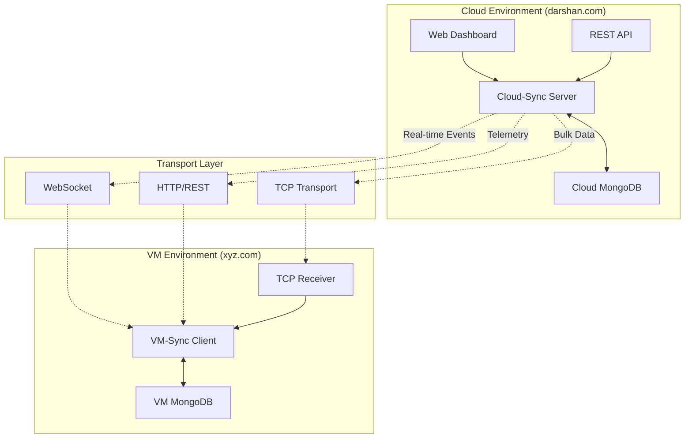

### **Core Components**

| Component | Purpose | Technology |
|-----------|---------|------------|
| `cloud-sync` | Central synchronization server | Go, MongoDB, WebSocket |
| `vm-sync` | Local synchronization client | Go, MongoDB, HTTP/TCP |
| **Transport Layer** | Multi-protocol data transfer | TCP, WebSocket, HTTP |
| **Authentication** | OAuth2 JWT-based security | JWT, BCrypt |
| **Dashboard** | Real-time monitoring UI | HTML5, WebSocket, REST |

---

## 🔧 **Component Architecture**

### **Cloud-Sync Architecture**

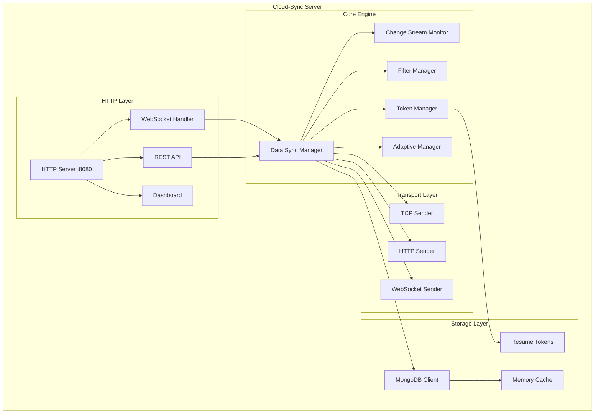

### **VM-Sync Architecture**

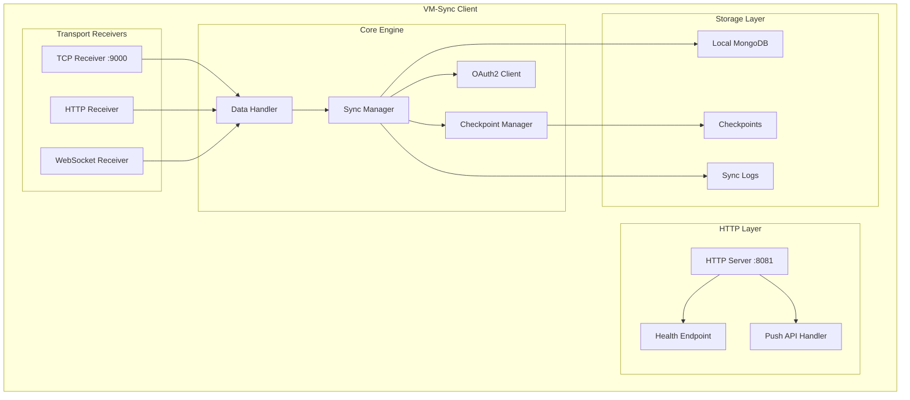

---

## 🔄 **Data Flow Diagrams**

### **Initial Sync Flow**

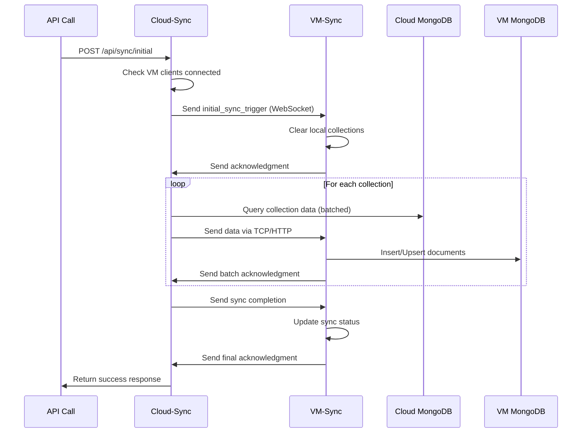

### **Real-time Sync Flow**

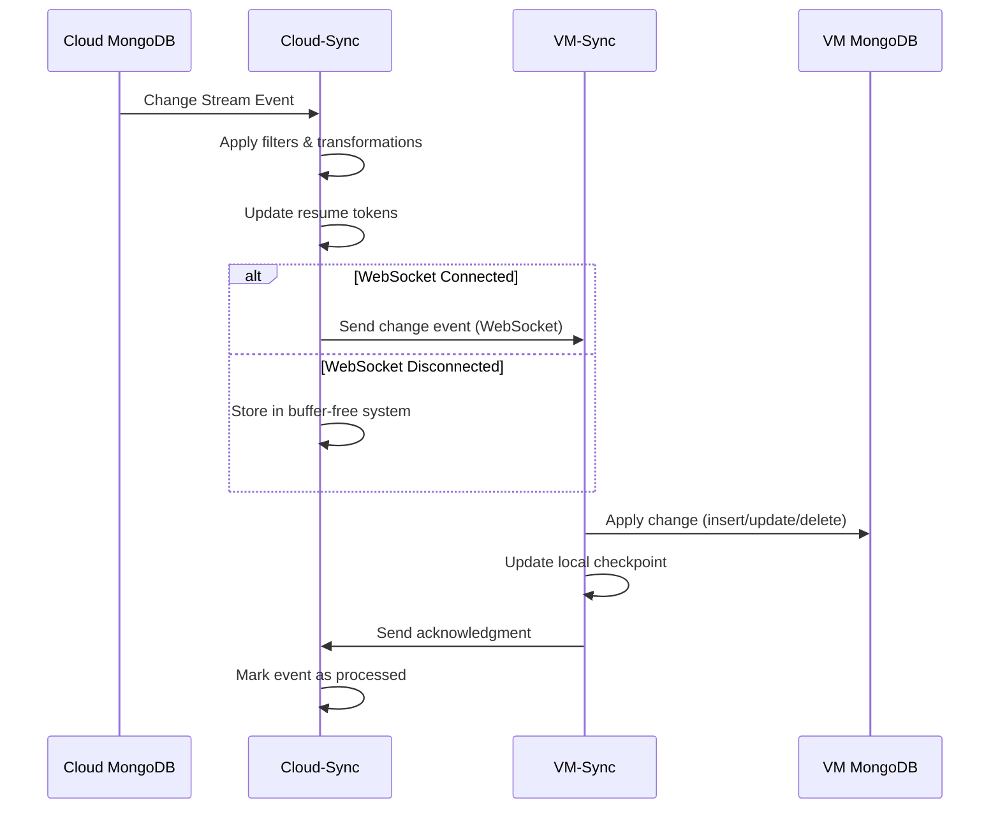

### **OAuth2 Authentication Flow**

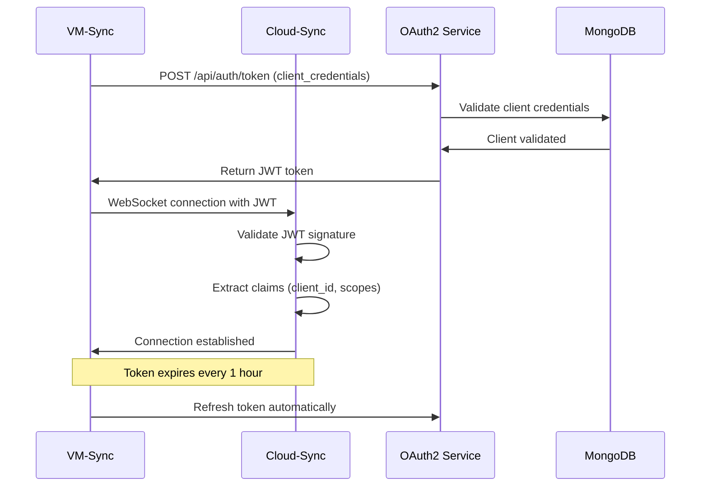

---

## 🚀 **Transport Layer Architecture**

### **Multi-Protocol Support**

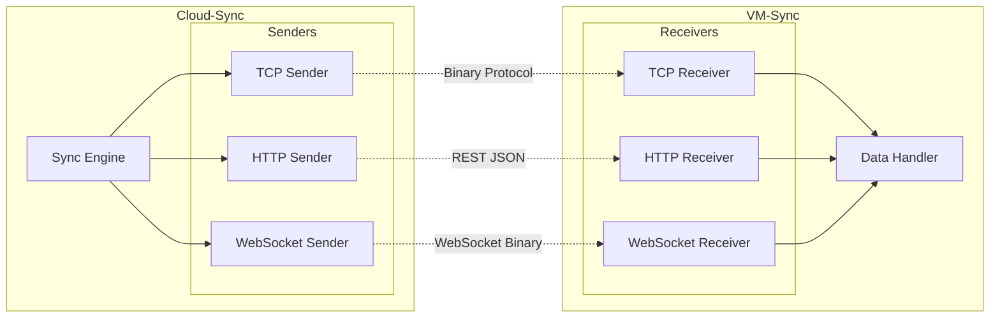

### **Transport Protocol Comparison**

| Protocol | Use Case | Performance | Reliability | Overhead |
|----------|----------|-------------|-------------|----------|
| **TCP** | Initial bulk sync | 🔥 Highest | 🛡️ Very High | 📦 Lowest |
| **WebSocket** | Real-time events | ⚡ High | 🔄 High | 📊 Medium |
| **HTTP/REST** | Telemetry, fallback | 🐌 Standard | ✅ Standard | 📈 Highest |

### **TCP Transport Protocol Design**

```
Frame Format:
┌─────────────┬─────────────┬─────────────┬─────────────┐
│   Magic     │   Version   │   Length    │   Checksum  │
│  (4 bytes)  │  (2 bytes)  │  (4 bytes)  │  (4 bytes)  │
├─────────────┼─────────────┼─────────────┼─────────────┤
│                    Payload Data                        │
│               (Variable length)                        │
└────────────────────────────────────────────────────────┘

Features:
- Compression: Zstd/LZ4 algorithms
- Checksums: CRC32 validation
- Acknowledgments: Reliable delivery
- Resume: Automatic recovery from failures
```

---

## 🔐 **Authentication & Security**

### **OAuth2 JWT Architecture**

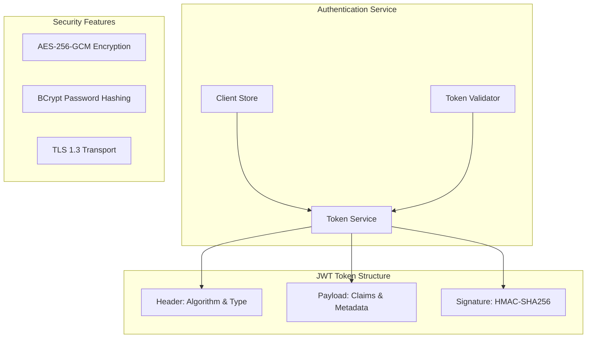

### **JWT Claims Structure**

```json
{
  "iss": "cloud-sync",
  "aud": ["vm-sync"],
  "sub": "vm_sync_client_id",
  "iat": 1703123456,
  "exp": 1703127056,
  "client_id": "vm_sync_abc123",
  "client_type": "vm-sync",
  "app_id": "data-sync-system",
  "scopes": ["sync:read", "sync:write", "telemetry:send"]
}
```

---

## ☸️ **Kubernetes Architecture**

### **Cross-Domain Deployment**

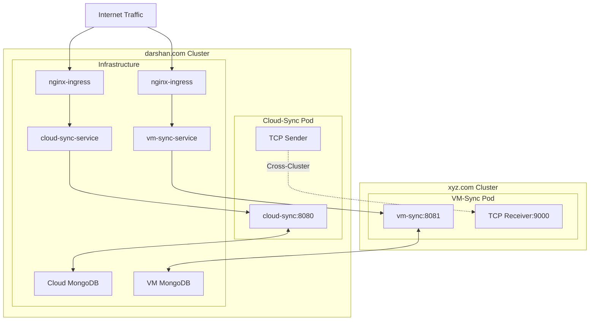

### **Kubernetes Configuration Requirements**

```yaml
# CRITICAL: Both services must bind to all interfaces
server:
  host: "0.0.0.0"  # ⚠️ REQUIRED for Kubernetes networking
  port: 8080       # cloud-sync
  # port: 8081     # vm-sync

# TCP transport must also bind to all interfaces
tcp_receiver:
  listen_addr: "0.0.0.0:9000"  # ⚠️ REQUIRED for TCP transport

# Why 0.0.0.0 is required:
# - Service discovery and routing
# - Health check probes from kubelet
# - Ingress/LoadBalancer traffic
# - Inter-pod communication
```

---

## ⚡ **Performance & Scalability**

### **Adaptive Resource Management**

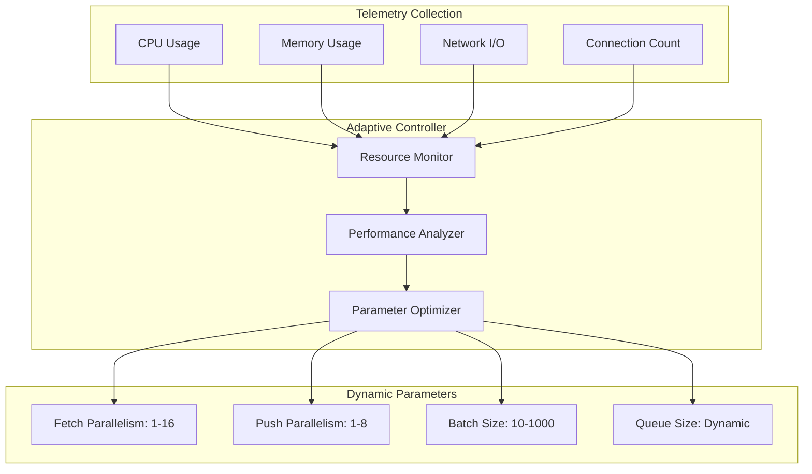

### **Performance Benchmarks**

| Metric | HTTP Transport | TCP Transport | Improvement |
|--------|----------------|---------------|-------------|
| **Throughput** | 10,000 docs/sec | 50,000 docs/sec | **5x faster** |
| **Latency** | 50ms avg | 10ms avg | **5x lower** |
| **Bandwidth** | 100 MB/sec | 300 MB/sec | **3x efficient** |
| **CPU Usage** | 60% | 40% | **33% less** |
| **Memory** | 512 MB | 256 MB | **50% less** |

### **Scalability Architecture**

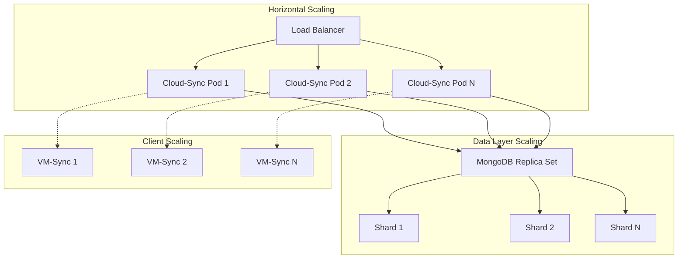

---

## 🎛️ **Configuration Management**

### **Configuration Hierarchy**

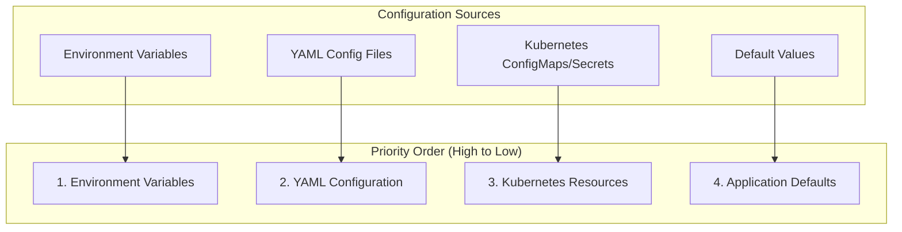

### **Configuration Categories**

| Category | Examples | Override Method |
|----------|----------|----------------|
| **Server** | host, port, timeouts | YAML config |
| **Security** | OAuth2 credentials, encryption keys | Environment/Secrets |
| **Database** | MongoDB URI, connection settings | Environment/Secrets |
| **Transport** | TCP settings, compression, buffers | YAML config |
| **Performance** | batch sizes, parallelism, workers | YAML config |

---

## 🔍 **Monitoring & Observability**

### **Monitoring Stack**

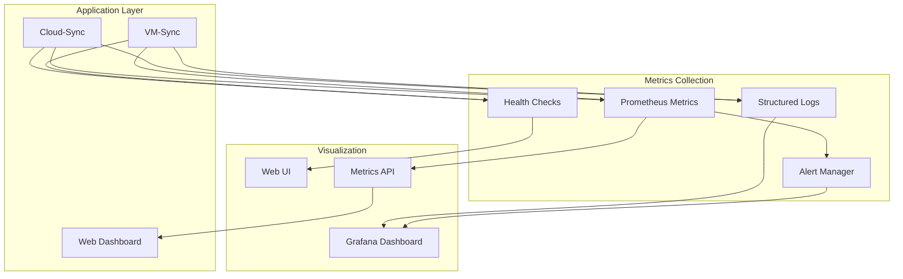

### **Key Metrics Tracked**

- **Throughput**: Documents synced per second
- **Latency**: Sync completion time
- **Error Rates**: Failed sync operations
- **Resource Usage**: CPU, memory, network I/O
- **Connection Health**: Active WebSocket/TCP connections
- **Queue Depths**: Pending sync operations

---

## 🔄 **Fault Tolerance & Recovery**

### **Recovery Mechanisms**

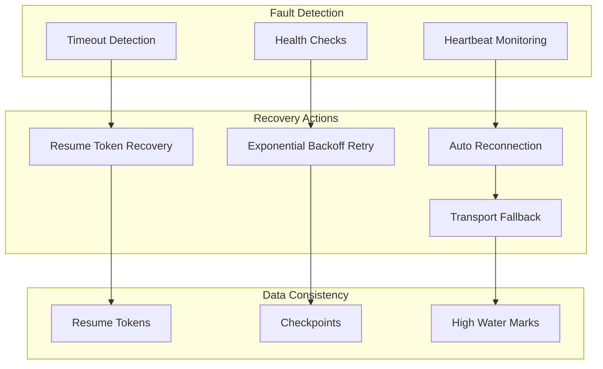

---

## 📊 **Data Consistency Model**

### **Consistency Guarantees**

1. **At-Least-Once Delivery**: Every change is guaranteed to be delivered
2. **Idempotent Operations**: Duplicate deliveries are handled safely
3. **Ordered Processing**: Changes are applied in the correct sequence
4. **Resume Capability**: Sync can resume from last known good state

### **Conflict Resolution**

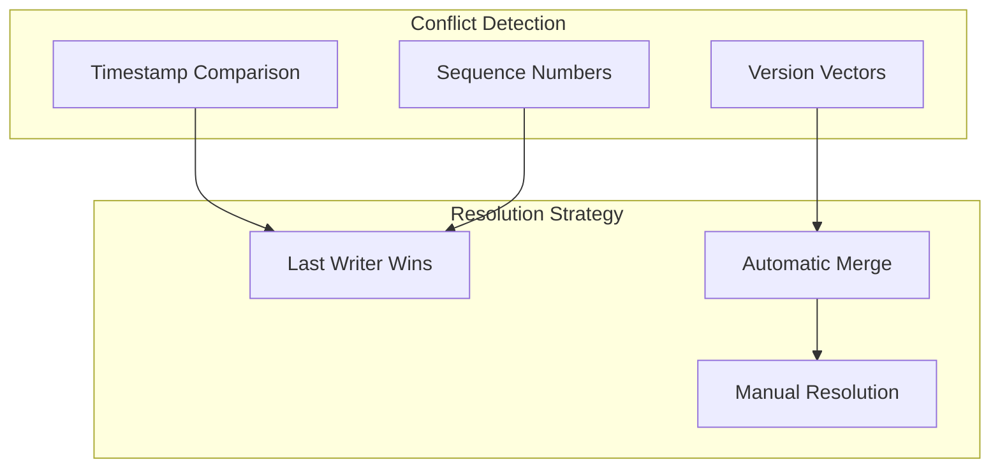

---

This architecture solution provides a comprehensive overview of the Go Data Sync system, covering all major components, data flows, and architectural decisions. The system is designed for high performance, reliability, and scalability in production environments.